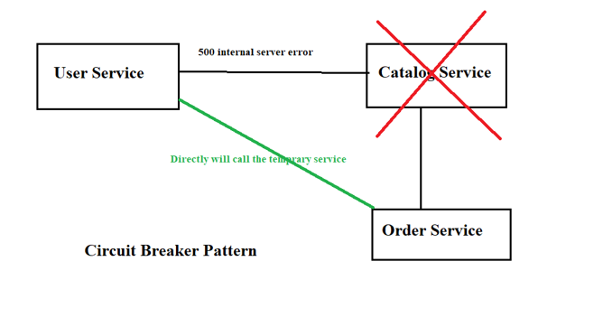
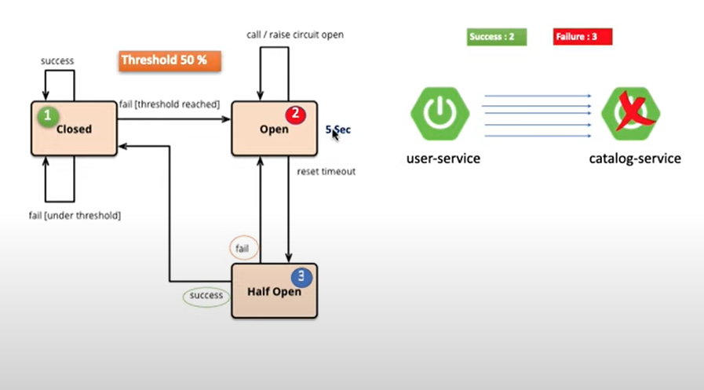

First Link:- http://localhost:9092/userorders

Secound Link:- http://localhost:9092/actuator/health

1. Catalog Service Down :-
   When the Catalog Service goes down or fails, the circuit breaker in your system detects this.
   The circuit breaker "opens" and starts blocking requests to the Catalog Service to prevent further failures.
2. Circuit Breaker Opens :-
   After several failed attempts (e.g., 3 failed requests), the circuit breaker enters an OPEN state.
   In this state, the system will not make requests to the Catalog Service anymore to avoid overloading it.
3. Wait Time in Open State:-
   The circuit breaker stays in the OPEN state for a specific time (like 5 seconds, as configured).
   After that, it transitions to a HALF-OPEN state where it tests if the Catalog Service is back up.
4. Half-Open State (Test Phase):-
   In the HALF-OPEN state, the circuit breaker sends a few test requests (e.g., 3 requests) to the Catalog Service.
   If the requests succeed (i.e., the Catalog Service is back up), the circuit breaker moves to the CLOSED state and normal requests are sent again.
   If the requests fail, the circuit breaker goes back to OPEN and the process repeats.
5. Service Recovery:-
   Once the Catalog Service is healthy and the test requests pass, the circuit breaker closes.
   This means the system can now send normal requests to the Catalog Service.
   Summary of States
   OPEN: Circuit breaker blocks all requests to the Catalog Service due to failures.
   HALF-OPEN: The system tests the Catalog Service with a few requests to see if it's back up.
   CLOSED: Normal requests are sent to the Catalog Service because it's working fine again.

RETRY CALLING METHOD

Let’s say you are fetching user data from another service:

First attempt: Fails because the service is down.
Retry 1: Waits for 2 seconds and tries again.
Retry 2-5: Continues retrying with a 2-second gap.
If retries fail: The fallback method is triggered, returning a default response.
